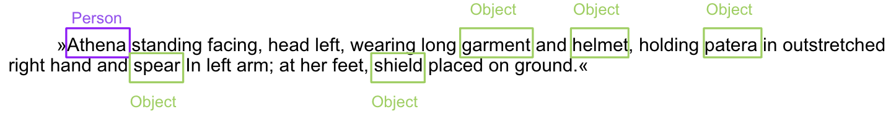
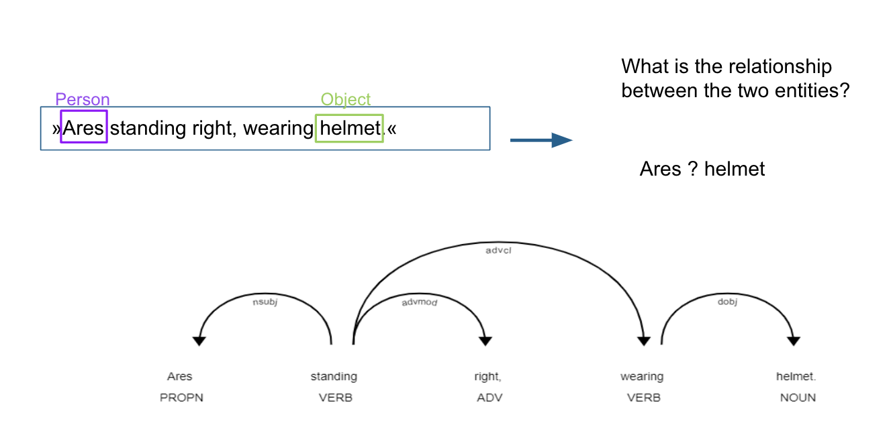
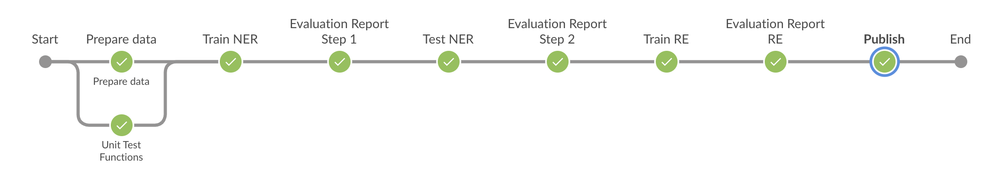

# NLP-on-multilingual-coin-descriptions
-----------

### Experimental: You can try it in Google Colab

-----------
Access relevant information from iconographies of the Corpus Numorum Online using natural language processing. Improvement of named entity recognition, followed by the extraction of relationships for the entity types "PERSON", "OBJECT", "ANIMAL" and "PLANT".
-----------
# Requirements:

- python          3.8.12
- pandas          1.3.3 
- spacy           2.3.7 
- scikit-learn       0.24.2
- (SQL database)
-----------

The process consists of two main steps: 

`Named entity recognition` 

`relationship extraction`

-----------
The py scripts around the models can be found here: `Docker/cnt/*`
The files in `Docker/*` are mainly for the automation process / creating the API.

To test the model, you can use the `Docker/dockerfile` to create a container with all the necessary dependencies. 

-----------

The pretrained models will be published in the future.

-----------
The automation of the process is implemented as a Jenkins pipeline, consisting mainly of the following steps

- Pull and verify the data/code
- Train the network model
- Evaluate and report
- Secondary evaluation on a fixed test set with special cases.
- Evaluate and report
- If the NER passes, then train the RE model
- Score and report (no second evaluation as data is limited)
- If it passes, then publish the models as an API

The `jenkinsfile` can be used to replicate the pipeline

-----------
## More detail into preprocessing and evaluating:
This project is based on the master theses:
Kerim Gencer und Chrisowalandis Deligio: [Natural Language Processing auf mehrsprachigen Münzdatensätzen – Untersuchung der Qualität, Datenqualität und Übertragbarkeit auf andere Datensätze](http://www.bigdata.uni-frankfurt.de/wp-content/uploads/2021/11/Masterthesis_Deligio_Gencer_DBISOnline.pdf)

------------

## TODO ##

- Structure of py scripts
- Automate hyperparamter search in pipeline
- Automate gridsearch in pipeline
- Automate Cross Validation in pipeline
-----------
## Reference
- https://www.corpus-nummorum.eu/
- http://numismatics.org/ocre/
